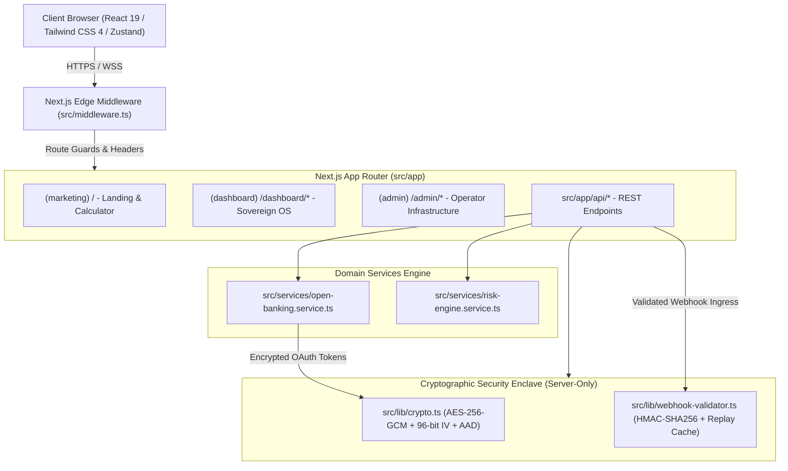

# System Architecture Document — MyMoney

**Product Name:** MyMoney (Sovereign Personal Finance)  
**Architecture Version:** 1.0.0-PROD  
**Target Environment:** Next.js App Router / Edge-compatible Serverless & Node.js  
**Last Updated:** 2026-09-26  

---

## 1. High-Level System Architecture

MyMoney is architected as an enterprise-grade financial management system leveraging modern React 19 and Next.js 16 App Router paradigms. The platform combines server-side cryptographic isolation with high-velocity client-side interaction primitives.



---

## 2. Technology Stack & Dependencies

| Layer | Technology | Version | Purpose |
| :--- | :--- | :--- | :--- |
| **Framework** | Next.js (App Router) | 16.3.5 | Server-rendered pages, Route Handlers, Edge middleware, Suspense streaming |
| **UI Library** | React & React DOM | 19.2.8 | Concurrent rendering, Action transitions, modern hooks |
| **Language** | TypeScript | 5.x | Strict compile-time typing across domain models and API contracts |
| **Styling** | Tailwind CSS & PostCSS | 4.x | Utility-first styling driven by `@theme` token definitions in `globals.css` |
| **State Management**| Zustand | 5.0.15 | Global client-side stores (`useStealthStore`, `useNodeMesh`, `useCalculator`) |
| **Data Viz** | Recharts | 3.10.1 | Donut charts, debt payoff curves, latency telemetry graphs |
| **Motion** | Framer Motion | 13.4.0 | Micro-interactions, modal transitions, layout animations |
| **Icons** | Lucide React | 1.47.0 | Vector iconography for financial nodes, categories, and controls |
| **Security** | Node.js Crypto / Server-Only | Native | AES-256-GCM encryption, HMAC-SHA256 timing-safe signatures |

---

## 3. Directory Structure & Modular Decomposition

```
mymoney/
├── src/
│   ├── app/                               # Next.js App Router domain tree
│   │   ├── (admin)/                       # System Operator route group
│   │   │   ├── admin/
│   │   │   │   ├── audit/page.tsx         # Inbound webhook cryptographic audit
│   │   │   │   ├── health/page.tsx        # Institutional bank API health telemetry
│   │   │   │   └── users/page.tsx         # Account governance & suspension
│   │   │   └── layout.tsx                 # Dark-forest operator layout
│   │   ├── (dashboard)/                   # Sovereign Executive OS route group
│   │   │   ├── dashboard/
│   │   │   │   ├── intelligence/page.tsx  # Subscriptions, Envelopes & Debt simulator
│   │   │   │   ├── ledger/page.tsx        # Searchable transaction feed & CSV export
│   │   │   │   ├── mesh/page.tsx          # Bank node mesh topology
│   │   │   │   ├── news/page.tsx          # Macroeconomic & CBN policy intelligence
│   │   │   │   ├── payday/page.tsx        # Autonomous waterfall inflow router
│   │   │   │   ├── profile/page.tsx       # Security enclave & tier management
│   │   │   │   └── page.tsx               # Executive Net Worth overview
│   │   │   └── layout.tsx                 # Dashboard shell with sidebar & header
│   │   ├── (marketing)/                   # Public marketing & conversion portal
│   │   │   ├── layout.tsx                 # Marketing header & footer shell
│   │   │   └── page.tsx                   # Landing page, runway engine & wizard
│   │   ├── api/                           # Backend API Route Handlers
│   │   │   ├── admin/                     # Health, users, and audit endpoints
│   │   │   ├── auth/                      # Session & NextAuth endpoints
│   │   │   ├── node/sync/                 # Bank node synchronization trigger
│   │   │   ├── subscriptions/             # Recurring subscription management & block
│   │   │   ├── transactions/              # Ledger retrieval & filtering
│   │   │   └── webhooks/openbanking/      # Inbound HMAC-verified bank webhook
│   │   ├── error.tsx                      # Global client-side error boundary
│   │   ├── globals.css                    # Design system tokens & utility overrides
│   │   ├── layout.tsx                     # Root HTML document & theme provider
│   │   ├── loading.tsx                    # Top-level route transition loader
│   │   └── not-found.tsx                  # 404 sovereign error fallback
│   ├── hooks/                             # Custom React & Zustand client hooks
│   │   ├── use-calculator.ts              # Cash runway dual-slider calculations
│   │   ├── use-node-mesh.ts               # Multi-bank node connection state
│   │   └── use-stealth.ts                 # Hardened obfuscation store with event sync
│   ├── lib/                               # Core libraries & utilities
│   │   ├── mock-data/                     # Institutional mock data repositories
│   │   ├── crypto.ts                      # Server-only AES-256-GCM encryption engine
│   │   ├── formatters.ts                  # Currency, date, and masked text formatters
│   │   ├── tailwind-tokens.ts             # Programmatic Earthy Minimal token exports
│   │   └── webhook-validator.ts           # Constant-time HMAC-SHA256 validator
│   ├── middleware.ts                      # Edge route guard & HTTP security headers
│   ├── services/                          # Business logic service classes
│   │   ├── open-banking.service.ts        # Open banking multi-institution adapter
│   │   └── risk-engine.service.ts         # Financial runway & risk scoring
│   └── types/                             # Comprehensive TypeScript type definitions
│       ├── index.ts                       # Core domain entities & interfaces
│       └── payday.ts                      # Biller catalog, cards, and inflow contracts
├── prd.md                                 # Product Requirements Document
├── architecture.md                        # System Architecture Document (this file)
├── rules.md                               # Coding Rules & Engineering Standards
├── design.md                              # UI/UX Direction & Design Token System
├── tasks.md                               # Tasks & Implementation Progress
└── memory.md                              # Project Context & Agent Memory
```

---

## 4. Frontend Architecture & State Management

### 4.1 Route Group Isolation
1. **`(marketing)`:** Lightweight client bundle focused on conversion, interactive runway calculations, and onboarding.
2. **`(dashboard)`:** Authenticated application shell providing seamless navigation across Net Worth, Ledger, Payday, and Intelligence suites.
3. **`(admin)`:** Dedicated dark-forest operator cockpit with isolated telemetry layouts and audit interfaces.

### 4.2 State Management Strategy
- **Zustand Client Stores:**
  - `useStealthStore`: Manages client-side obfuscation state (`stealthModeEnabled`). Hardened with cross-window/tab `storage` event listeners and custom `mm-stealth-change` dispatchers to ensure instantaneous synchronized masking across all components.
  - `useNodeMesh`: Orchestrates connection statuses, ping latencies, and sync cycles across connected banking nodes.
  - `useCalculator`: Handles cash runway calculations, monthly burn rate inputs, and subscription savings projections.
- **Server Component Streaming & Suspense:**
  - High-traffic pages (such as `/dashboard/ledger`) isolate URL search param reading inside client components wrapped with Next.js `<Suspense>` boundaries to prevent client-side hydration de-opt.

---

## 5. Security & Cryptographic Architecture

### 5.1 Symmetric At-Rest Encryption (`src/lib/crypto.ts`)
- **Algorithm:** Authenticated `aes-256-gcm` (Galois/Counter Mode).
- **Key Derivation:** 256-bit cryptographic key read from `ENCRYPTION_KEY` environment variable. Fails closed on initialization if missing or malformed.
- **Initialization Vector (IV):** 96-bit (12-byte) cryptographically secure random IV generated per encryption invocation via `crypto.randomBytes(12)`.
- **Authentication Tag:** Full 128-bit (16-byte) authentication tag preventing ciphertext tampering.
- **Context Binding via AAD:** Additional Authenticated Data (`aad`), such as `${userId}:${bankConnectionId}`, is bound to the cipher. A valid ciphertext copied to another user record fails decryption.
- **Boundary Enforcement:** Guarded with `import 'server-only'` to guarantee that encryption keys and routines never leak into client-side JavaScript bundles.

### 5.2 Inbound Webhook Verification (`src/lib/webhook-validator.ts`)
- **Signature Mechanism:** Constant-time `crypto.timingSafeEqual` HMAC-SHA256 signature verification.
- **Timestamp Verification:** Strict 10-digit Unix timestamp validation with a 300-second (5-minute) clock-skew window against replay vulnerabilities.
- **Secret Rotation:** Supports dual-secret verification (`OPENBANKING_WEBHOOK_SECRET` and optional `OPENBANKING_WEBHOOK_SECRET_PREVIOUS`), allowing zero-downtime secret rotation.
- **Replay Deduplication Cache:** In-memory event ID de-duplication cache ensuring identical webhook payloads cannot be re-executed within the tolerance window.

### 5.3 Edge Middleware & Defense-in-Depth (`src/middleware.ts`)
- **Route Guard:** Intercepts unauthenticated requests to `/dashboard/*`, `/admin/*`, and `/api/admin/*`, redirecting to `/` with contextual alert parameters (`auth_required=1` or `admin_auth_required=1`).
- **HTTP Security Headers:**
  - `X-Frame-Options: DENY` (Clickjacking mitigation)
  - `X-Content-Type-Options: nosniff` (MIME-sniffing prevention)
  - `Referrer-Policy: strict-origin-when-cross-origin`
  - `Permissions-Policy: camera=(), microphone=(), geolocation=(), payment=()`

---

## 6. Service & Domain Logic Layer

### 6.1 Open Banking Service (`src/services/open-banking.service.ts`)
- Manages institution connections across Nigerian Tier-1 banks (Guaranty Trust Bank, Stanbic IBTC, Zenith Bank, Access Bank) and digital MFBs (Kuda MFB, Moniepoint).
- Normalizes disparate institution payload structures into sovereign `BankNode` and `Transaction` records.
- Simulates realistic institution latency, jitter, and HTTP 429 rate-limiting scenarios.

### 6.2 Risk & Runway Engine (`src/services/risk-engine.service.ts`)
- Calculates dynamic cash runway months based on liquid vs. illiquid allocations.
- Heuristic zombie subscription detection analyzing transaction regularity against last login and activity timestamps.
- Implements Debt Avalanche (greedy sorting by highest APR) and Debt Snowball (greedy sorting by lowest principal balance) payoff curves.

---

## 7. Deployment & Operational Architecture

- **Build Pipeline:** `next build` generates optimized static pages, dynamic server-rendered routes, and type-checked server bundles.
- **Serverless Readiness:** Stateless API Route Handlers designed for deployment on Vercel, AWS ECS, or containerized Docker environments.
- **Graceful Error Recovery:** Built-in error boundaries (`error.tsx`), route loading spinners (`loading.tsx`), and resource fallback views (`not-found.tsx`).

---

## 8. Continuous Maintenance Mandate

> **CRITICAL ARCHITECTURAL RULE:** Any modification to route layouts, API endpoints, cryptographic mechanisms, design tokens, or state stores MUST be reflected immediately in `architecture.md`, `prd.md`, and `rules.md`.
